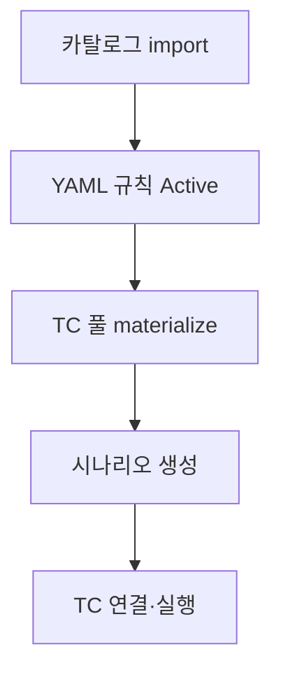

# 시작하기

## 로그인과 메뉴

FINIX 웹 UI는 사이드바 메뉴로 이동합니다.

| 메뉴 | 경로 | 로그인 |
|------|------|--------|
| AI 시나리오 생성 | `/` | 불필요 |
| 시나리오 관리 | `/scenario-registry` | 필요 |
| 테스트케이스 관리 | `/test-cases` | 필요 |
| 규칙/메타 관리 | `/rules` | 필요 |
| 테스트 이력 | `/history` | 필요 |
| 매뉴얼 | `/manual` | 필요 |

로그인(`/login`)은 **Mock 인증**입니다. 사용자 ID·비밀번호 형식만 맞으면 `qa.editor` 또는 `qa.approver` 역할로 세션을 만듭니다. 백엔드 API는 별도 JWT 검증 없이 호출됩니다(운영 시 보안 보강 필요).

### 역할 차이 (현재 UI)

| 역할 | 용도 |
|------|------|
| `qa.editor` | 규칙 편집·YAML 저장 |
| `qa.approver` | 승인·활성화 버튼 (워크플로 UI) |

실제 권한 강제는 백엔드에 미구현 — UI 표시용입니다.

---

## 로컬 실행

### Backend

```bash
cd backend
python -m venv .venv
.venv\Scripts\activate   # Windows
pip install -r requirements.txt
uvicorn app.main:app --reload --host 127.0.0.1 --port 8000
```

### Frontend

```bash
cd frontend
npm install
npm run dev
```

- UI: `http://localhost:5173`
- API 프록시: `/api` → `http://127.0.0.1:8000`

### `.env` 필수·권장

| 변수 | 설명 |
|------|------|
| `DATABASE_URL` | `sqlite+aiosqlite:///./fcc_test_automation.db` 또는 PostgreSQL |
| `LLM_API_KEY` | AI 시나리오, YAML AI, 매뉴얼 RAG |
| `LLM_BASE_URL` | OpenAI 호환 엔드포인트 (선택) |
| `CBS_SERVICE_JSON_PATH` | 기본 `backend/cbs_srvc.json` |
| `MANUAL_MD_PATH` | 기본 `docs/FINIX_MANUAL.md` |
| `MANUAL_DOCS_DIR` | 기본 `docs/manual` |

---

## 권장 최초 설정 순서



1. **서비스 카탈로그 import** — `POST /api/v1/service-catalog/import` (UI 버튼 없음)
2. **YAML 규칙 등록** — `/rules` 소스 붙여넣기 또는 YAML 편집 → **활성화**
3. **테스트케이스 풀** — `/test-cases` → **YAML에서 생성**
4. **시나리오** — 홈 AI 또는 `/scenario-registry` 마법사
5. **실행** — `/test-case/:scenarioId` → 테스트 실행

상세 E2E: `docs/manual/10-e2e-walkthrough-py027.md`

---

## 두 가지 시나리오 저장소 (중요)

| 저장소 | 위치 | 용도 |
|--------|------|------|
| DB 시나리오 | `scenarios` 테이블 | AI 홈, `/scenario/:id`, 백엔드 실행 |
| 시나리오 레지스트리 | `localStorage` | 폴더, Export/Import, 마법사 |

**자동 동기화 없음.** 팀 공유는 레지스트리 Export JSON 또는 DB 백업.

---

## 매뉴얼 챗 (`/manual`)

- 프로그램 전체 문서 기반 Q&A
- 문서 수정 후 `python backend/scripts/reindex_manual.py` 권장
- 질문 예: 「PY027 YAML 등록 방법」, 「materialize 400 원인」

자세한 운영: `docs/manual/13-rag-and-maintenance.md`
